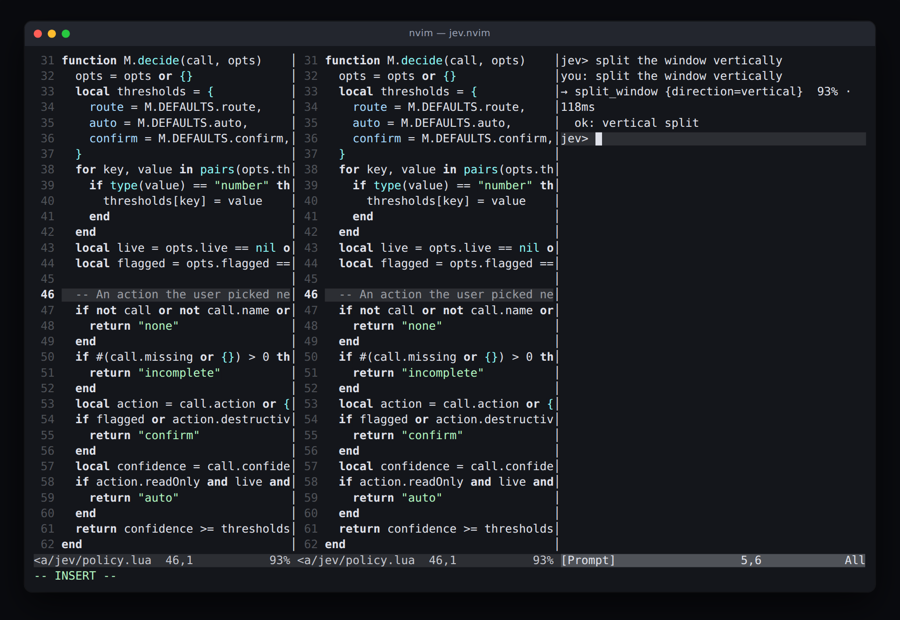
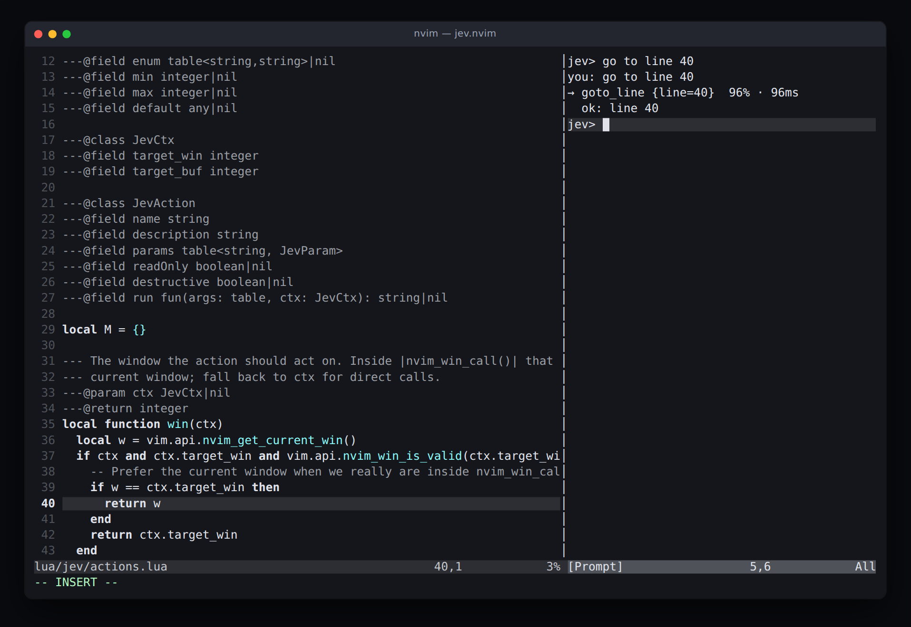
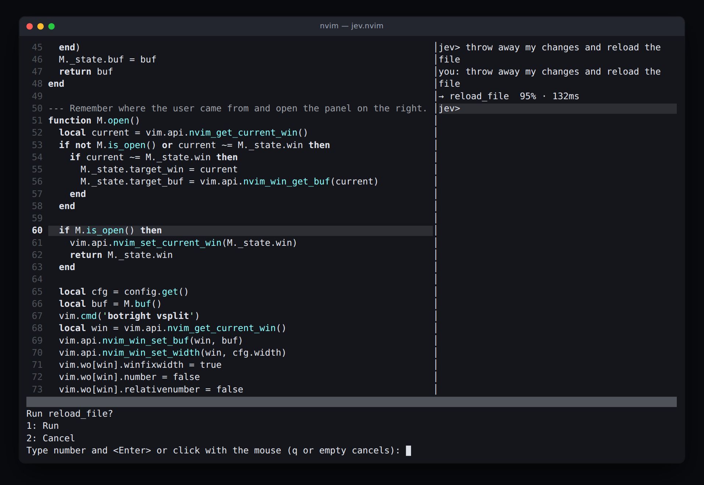
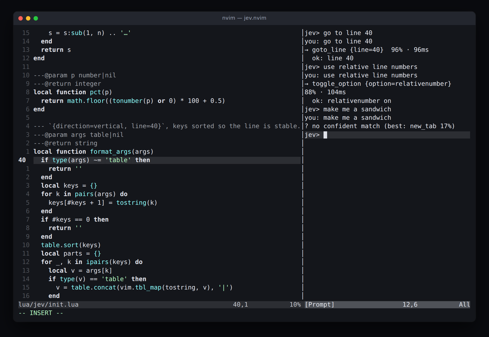

# jev.nvim

Ask Neovim for something in plain words. It picks an editor action and runs it.

```
jev> split the window vertically
you: split the window vertically
→ split_window {direction=vertical}  92% · 118ms
  ok: vertical split
```

jev.nvim talks to **[Jev](https://docs.typesafe.ai), TypeSafe's System One model**.
Jev is not an LLM. It never writes text, never invents an argument, never runs a
command it made up. It is handed a fixed catalog of editor actions plus your words,
and it answers typed questions: *which action?*, *which option for `direction`?*,
*which words give `path`?* — each with a probability. The plugin decodes those picks
into a call and applies a policy to it. Nothing is generated.

Ported from [sdras/jev-webmcp-extension](https://github.com/sdras/jev-webmcp-extension),
which does the same thing for WebMCP tools in a browser side panel.

## Screenshots



`:Jev` opens the panel on the right. *split the window vertically* routes to
`split_window`, the `direction` option is filled from the same request, and the
split is already there.



*go to line 40* decodes to `goto_line {line=40}` — the 40 is lifted from your own
words, never written by a model. Read-only and above the `auto` threshold, so it
runs without asking.



*throw away my changes and reload the file* lands on `reload_file`, which is
marked destructive, so the policy stops at `confirm` and `vim.ui.select` asks
before anything happens.



Nothing in the catalog makes a sandwich, so nothing is invented: the panel says
so and names the runner-up route. Above it, the two requests that did land — the
transcript is one buffer and it keeps its history.

These are captures of the plugin actually running, made by
`node scripts/screenshot.mjs`: it drives a real Neovim over msgpack-rpc and
answers each request from a table of canned, API-shaped responses in
`scripts/shot_init.lua`. No API key, no network call, nothing drawn by hand.

## Install

With [lazy.nvim](https://github.com/folke/lazy.nvim):

```lua
{
  'balazsorban44/nvim-jev-plugin',
  cmd = { 'Jev', 'JevToggle', 'JevAsk' },
  keys = {
    { '<leader>j', '<cmd>JevToggle<cr>', desc = 'Toggle jev' },
  },
  opts = {},
}
```

Requirements: Neovim >= 0.10, `curl`, and a TypeSafe API key from
[console.typesafe.ai/keys](https://console.typesafe.ai/keys). Export it as
`TYPESAFE_API_KEY` and you are done; `opts = {}` is enough.

## Setup

Every option, with its default:

```lua
require('jev').setup({
  api_key = nil,          -- else $TYPESAFE_API_KEY, read at request time
  model = 'jev-latest',
  url = 'https://api.typesafe.ai/v1/systemone',
  timeout_ms = 15000,
  width = 44,             -- panel width
  prompt = 'jev> ',
  always_confirm = false, -- ask before running anything
  thresholds = { route = 0.5, auto = 0.8, confirm = 0.6 },
})
```

## Commands

| Command | What it does |
| --- | --- |
| `:Jev` | Toggle the panel |
| `:JevToggle` | Same, with a name that reads better in a mapping |
| `:JevAsk {text}` | Open the panel if closed, then ask `{text}` |

In the panel, type on the prompt line and press `<CR>`. The panel is a
`botright vsplit` with a fixed width; the transcript survives a toggle.

## Actions

The catalog is fixed — this is the whole surface Jev can reach.

| Action | Arguments | Notes |
| --- | --- | --- |
| `save_file` | – | `:w` |
| `save_all` | – | `:wa` |
| `close_window` | – | refuses on the last window |
| `quit_all` | – | destructive |
| `reload_file` | – | destructive |
| `open_file` | `path` | |
| `goto_line` | `line` | read-only, clamped to the buffer |
| `split_window` | `direction`: vertical \| horizontal | |
| `new_tab` | – | |
| `next_buffer` | – | read-only |
| `previous_buffer` | – | read-only |
| `toggle_option` | `option`: number \| relativenumber \| wrap \| spell \| list \| cursorline | |
| `search` | `pattern` | read-only |
| `undo` | – | |
| `redo` | – | |
| `format_buffer` | – | via LSP |
| `select_all` | – | read-only |
| `set_filetype` | `filetype` | |
| `show_diagnostics` | – | read-only, into quickfix |

Every argument of every action is asked in the same request, so a decision never
costs a second round trip. Actions run inside `nvim_win_call` on the window you
came from, wrapped in `pcall`: a failing action prints into the panel and is never
thrown at you.

## Confidence tiers

Each answer carries a probability. A call's **confidence is the lowest** of them —
the route and every argument — because one wrong argument spoils the result. A
product would answer a different question and would punish actions simply for
taking more arguments.

The policy then reads, in order:

| Tier | When | What happens |
| --- | --- | --- |
| `none` | no action fits, or route probability < `route` (0.5) | `? no confident match (best: goto_line 41%)` |
| `incomplete` | a required argument has no usable value | `? missing: path` |
| `confirm` | destructive, or confidence < `confirm` (0.6) | `vim.ui.select` asks first |
| `auto` | read-only and confidence >= `auto` (0.8) | runs |
| `ready` | everything else at or above `confirm` | runs |

`auto` and `ready` both run: you pressed `<CR>`, that was the click. Set
`always_confirm = true` to be asked every time anyway.

## Health

```vim
:checkhealth jev
```

Checks the Neovim version, `curl`, whether a key is configured (it never prints
it), and the size of the catalog.

## Tests

```bash
nvim --headless --clean -u NONE -l tests/run.lua < /dev/null
```

No plenary, no network. `< /dev/null` is required: the stock `vim.ui.select` reads
stdin and will end a headless process outright, so tests monkeypatch it too.

The screenshots above are regenerated the same way — a real editor, a stubbed
client:

```bash
cd scripts && npm install      # once: neovim + playwright-core, not committed
node scripts/screenshot.mjs    # all four scenes into assets/
node scripts/screenshot.mjs 03 # just the one whose name matches
```

Each scene spawns `nvim --embed`, attaches a 120x34 UI, types the request into
the panel, then paints the cell grid Neovim sent back into a PNG. `JEV_NVIM` and
`CHROMIUM_PATH` override the binaries it reaches for.

## License

MIT. See [LICENSE](LICENSE).
